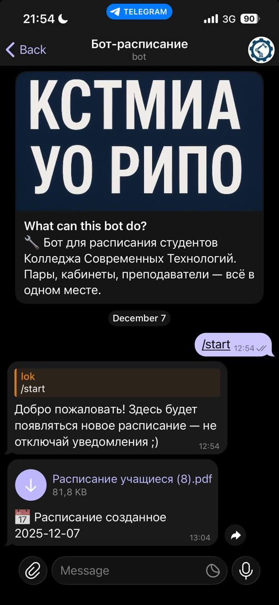

# 🗓️ Schedule Bot (Telegram Bot)

The bot automates the routine tasks for students — it shows the schedule and immediately notifies about any changes to it!

---

## ✨ Features

- **`/start`** — subscribes you to receive the daily schedule.  
  After launch, the bot works **automatically**: sends the current schedule and immediately reports any changes.
- The bot handles everything else on its own — you no longer need to search or check anything manually.

---

## 🚀 Installation and Running (Locally)

### Technical Requirements
1. **Clone the repository**
   ```bash
   https://github.com/zeqnmap/RIPO_bot.git
   cd your-repository
   ```

2. Python 3.13+
    ```bash
    python --version
    ```

3. Create and activate a virtual environment
    ```bash
    python -m venv venv
    # For Windows:
    venv\Scripts\activate
    # For Linux/Mac:
    source venv/bin/activate
    ```
   Or go to settings -> python -> interpreter -> add new interpreter

4. Install dependencies
   ```bash
   pip install -r requirements.txt
   ```

5. Set up private data
   - Get a bot token from @BotFather on Telegram
   - Create a `.env` file based on the `env.template`
   - Insert your bot token there

6. Run the bot
    ```bash
   python bot.py
   ```

---

## 🛠️ Technologies
- Python 3.13
- Libraries:
     - pytelegrambotapi - for working with the Telegram Bot API
     - selenium - for parsing the schedule from the website
     - multithreading - for faster and more optimized work

---

## 📸 Usage Examples



---

## ☁️ Deployment

To run 24/7, the bot is deployed on Timeweb.
You can use any cloud hosting: Heroku, Selectel, Railway, VPS/VDS from other providers

---

## 🤝 Contributing

Found a bug or have an idea for improvement?
Contact me on Telegram: @zeqnmap

---

`Bot created for the convenience of students`